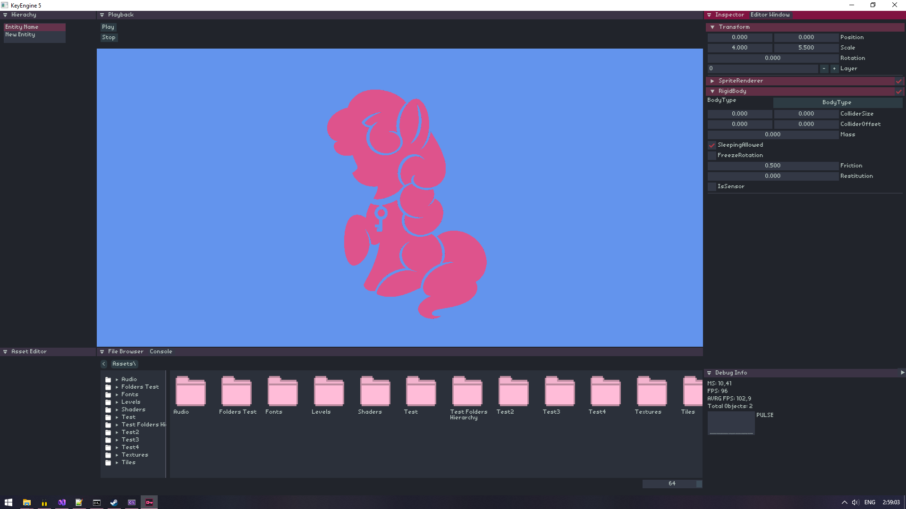
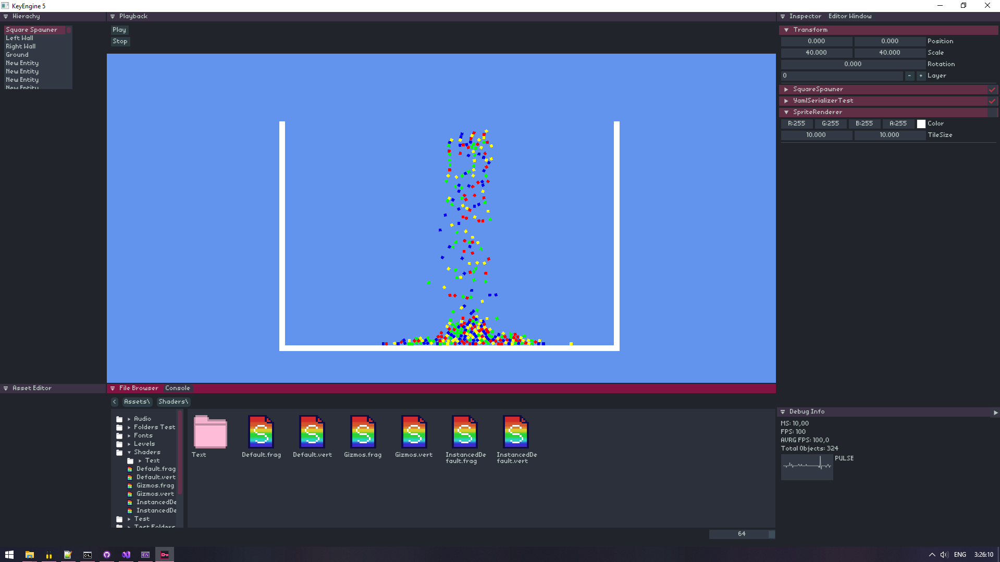
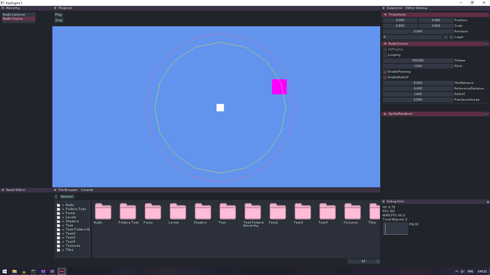

# KeyEngine
KeyEngine is an open-source game engine/framework for creating 2D games, powered by the Unity-like ECS

The engine is NOT finished yet, it is under active development.

# Build Requiments
1. **Latest [Git](https://git-scm.com/downloads)**
2. **[.NET 10.0 SDK](https://dotnet.microsoft.com/en-us/download/dotnet/10.0)**
3. **[Visual Studio 2026](https://visualstudio.microsoft.com/downloads/)**

> [!WARNING]
> Copy the contents of the "Content" folder to the build folder

# Supported O/S
- ✔️ Windows 10
- ✔️ Linux
- ❓ MacOS
- Tested linux distros:
- ✔️ Ubuntu
- ✔️ Linux Mint
- ✔️ Fedora
- ✔️ Arch (KDE Plasma)
- ✔️ CachyOS (KDE Plasma)